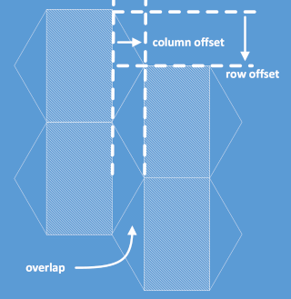
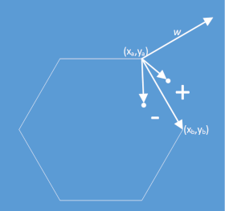

# Hex Map UI

## Basic Structure
The hex map is made up of rows and columns the same as a grid square map. There are a few key properties with a hex map that we need to deal with in the UI.



 Property | Description 
----------|-------------
 Radius | The visual radius of a cell. This is different than the scale radius of a cell that indicates the "real world" radius typically in miles, kilometes, etc.
 Column Offset  | The horizontal offset used in column hit testing. The horizontal offset is the overlap area on the left of a hex cell calculated as ```radius * COS_HEX```
 Row Offset     | The vertical offset for every other row in the map. The vertical offset is calculated as ```radius * 0.5```.

 These properties must be modified by horizontal and vertical DPI for the current display and by any viewport offsets in the hex map view.


## Hit Testing

Hit testing the hex map for user interactions such as cell editing or selection is relatively simple. Initially we determine the candidate column and row using the column and row offsets for the map. 

The most complex part of the hit test involves using a normal to determine what cell the user gestured occured in when the gesture is in the X overlap area of a cell.



We need to know the sign of the normal created by the (x,y) coordinates of the gesture to calculate what cell the gesture occured in. A positive (+) normal means that the gesture occurs in the next column if the Y coordinate is in the upper half of the current cell. Similarly a negative (-) normal indicates that the gesture occured in the next column in the lower half of the current cell.

We need to be prepared to handle an input gesture in column -1 when the map viewport is at X=0 since the gesture could occur in what would be the X overlap area for that column.